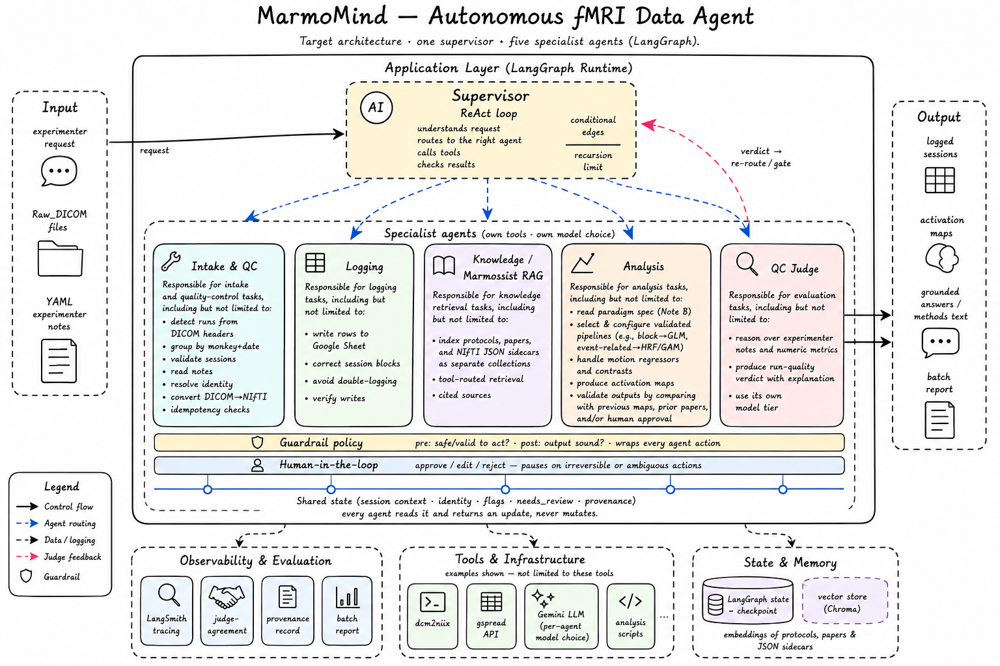

  

# MarmoMind_Beta
Autonomous multi agent AI system for fMRI data processing in LangGraph: Architecture &amp; vision.

**MarmoMind_Alpha** was the **feasibility study** which was implemented using **Claude Agent SDK**.
The current version, **MarmoMind_Beta**, handles the entire data processing workflow from raw scans through quality control, logging, knowledge retrieval (RAG: Marmossits), and analysis pipeline  using a  supervisor agent routing work to five specialist agents, under human-in-the-loop guardrails.

## Design principle
The LLM reasons, routes, and orchestrates; deterministic, validated python code does the mechanical steps. 

## Agents
- **Intake & QC** — detect runs from DICOM headers, group by session, validate,
  read notes, resolve identity, convert DICOM→NIfTI.
- **QC Judge** — reason over experimenter notes and metrics to judge run quality.
- **Logging** — write structured session records to a lab sheet, safely and idempotently.
- **Knowledge (Marmossist)** — retrieval over protocols, literature, and scan metadata.
- **Analysis** — select and configure validated analysis pipelines, produce activation maps.

## Status
Architecture is in development. Implementation code will be published when the full pipeline is built and evaluated.
